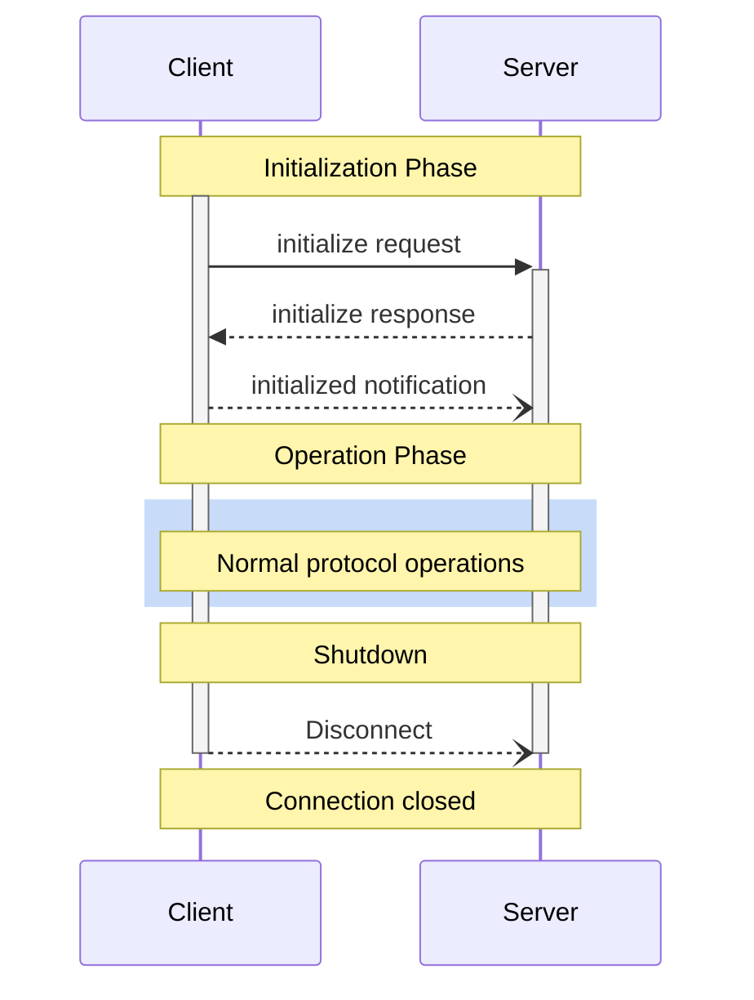
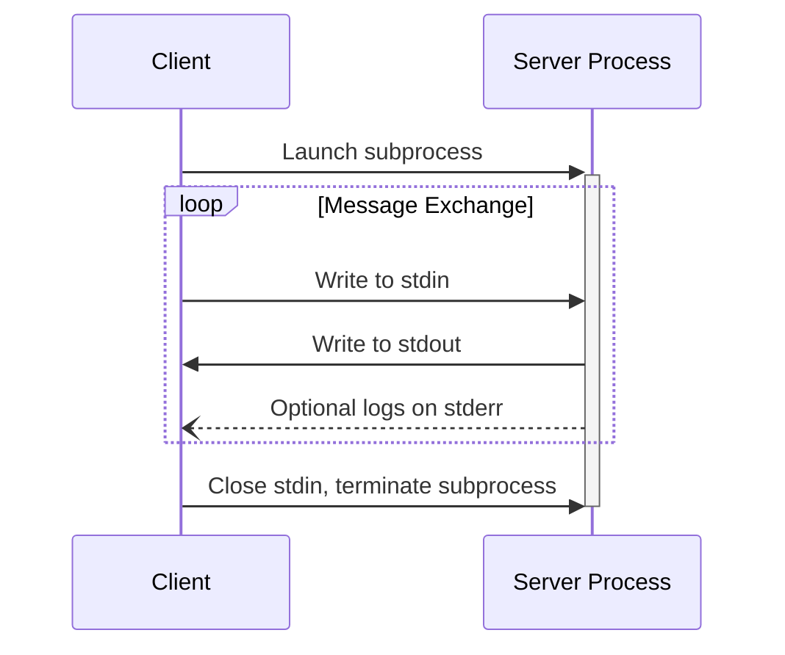
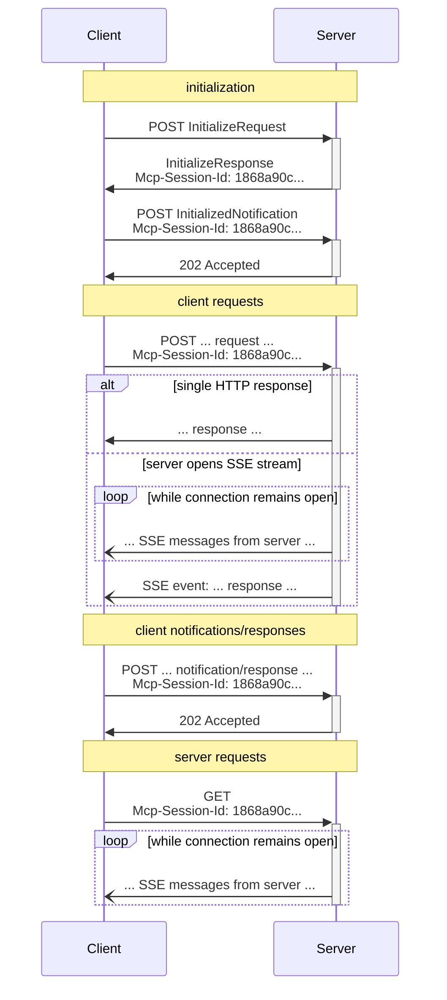

# Overview

<Info>**Protocol Revision**: 2025-03-26</Info>

The Model Context Protocol consists of several key components that work together:

* **Base Protocol**: Core JSON-RPC message types
* **Lifecycle Management**: Connection initialization, capability negotiation, and
  session control
* **Server Features**: Resources, prompts, and tools exposed by servers
* **Client Features**: Sampling and root directory lists provided by clients
* **Utilities**: Cross-cutting concerns like logging and argument completion

All implementations **MUST** support the base protocol and lifecycle management
components. Other components **MAY** be implemented based on the specific needs of the
application.

These protocol layers establish clear separation of concerns while enabling rich
interactions between clients and servers. The modular design allows implementations to
support exactly the features they need.

## Messages

All messages between MCP clients and servers **MUST** follow the
[JSON-RPC 2.0](https://www.jsonrpc.org/specification) specification. The protocol defines
these types of messages:

### Requests

Requests are sent from the client to the server or vice versa, to initiate an operation.

```typescript
{
  jsonrpc: "2.0";
  id: string | number;
  method: string;
  params?: {
    [key: string]: unknown;
  };
}
```

* Requests **MUST** include a string or integer ID.
* Unlike base JSON-RPC, the ID **MUST NOT** be `null`.
* The request ID **MUST NOT** have been previously used by the requestor within the same
  session.

### Responses

Responses are sent in reply to requests, containing the result or error of the operation.

```typescript
{
  jsonrpc: "2.0";
  id: string | number;
  result?: {
    [key: string]: unknown;
  }
  error?: {
    code: number;
    message: string;
    data?: unknown;
  }
}
```

* Responses **MUST** include the same ID as the request they correspond to.
* **Responses** are further sub-categorized as either **successful results** or
  **errors**. Either a `result` or an `error` **MUST** be set. A response **MUST NOT**
  set both.
* Results **MAY** follow any JSON object structure, while errors **MUST** include an
  error code and message at minimum.
* Error codes **MUST** be integers.

### Notifications

Notifications are sent from the client to the server or vice versa, as a one-way message.
The receiver **MUST NOT** send a response.

```typescript
{
  jsonrpc: "2.0";
  method: string;
  params?: {
    [key: string]: unknown;
  };
}
```

* Notifications **MUST NOT** include an ID.

### Batching

JSON-RPC also defines a means to
[batch multiple requests and notifications](https://www.jsonrpc.org/specification#batch),
by sending them in an array. MCP implementations **MAY** support sending JSON-RPC
batches, but **MUST** support receiving JSON-RPC batches.

## Auth

MCP provides an [Authorization](/specification/2025-03-26/basic/authorization) framework for use with HTTP.
Implementations using an HTTP-based transport **SHOULD** conform to this specification,
whereas implementations using STDIO transport **SHOULD NOT** follow this specification,
and instead retrieve credentials from the environment.

Additionally, clients and servers **MAY** negotiate their own custom authentication and
authorization strategies.

For further discussions and contributions to the evolution of MCP’s auth mechanisms, join
us in
[GitHub Discussions](https://github.com/modelcontextprotocol/specification/discussions)
to help shape the future of the protocol!

## Schema

The full specification of the protocol is defined as a
[TypeScript schema](https://github.com/modelcontextprotocol/specification/blob/main/schema/2025-03-26/schema.ts).
This is the source of truth for all protocol messages and structures.

There is also a
[JSON Schema](https://github.com/modelcontextprotocol/specification/blob/main/schema/2025-03-26/schema.json),
which is automatically generated from the TypeScript source of truth, for use with
various automated tooling.

# Lifecycle

<Info>**Protocol Revision**: 2025-03-26</Info>

The Model Context Protocol (MCP) defines a rigorous lifecycle for client-server
connections that ensures proper capability negotiation and state management.

1. **Initialization**: Capability negotiation and protocol version agreement
2. **Operation**: Normal protocol communication
3. **Shutdown**: Graceful termination of the connection



## Lifecycle Phases

### Initialization

The initialization phase **MUST** be the first interaction between client and server.
During this phase, the client and server:

* Establish protocol version compatibility
* Exchange and negotiate capabilities
* Share implementation details

The client **MUST** initiate this phase by sending an `initialize` request containing:

* Protocol version supported
* Client capabilities
* Client implementation information

```json
{
  "jsonrpc": "2.0",
  "id": 1,
  "method": "initialize",
  "params": {
    "protocolVersion": "2024-11-05",
    "capabilities": {
      "roots": {
        "listChanged": true
      },
      "sampling": {}
    },
    "clientInfo": {
      "name": "ExampleClient",
      "version": "1.0.0"
    }
  }
}
```

The initialize request **MUST NOT** be part of a JSON-RPC
[batch](https://www.jsonrpc.org/specification#batch), as other requests and notifications
are not possible until initialization has completed. This also permits backwards
compatibility with prior protocol versions that do not explicitly support JSON-RPC
batches.

The server **MUST** respond with its own capabilities and information:

```json
{
  "jsonrpc": "2.0",
  "id": 1,
  "result": {
    "protocolVersion": "2024-11-05",
    "capabilities": {
      "logging": {},
      "prompts": {
        "listChanged": true
      },
      "resources": {
        "subscribe": true,
        "listChanged": true
      },
      "tools": {
        "listChanged": true
      }
    },
    "serverInfo": {
      "name": "ExampleServer",
      "version": "1.0.0"
    }
  }
}
```

After successful initialization, the client **MUST** send an `initialized` notification
to indicate it is ready to begin normal operations:

```json
{
  "jsonrpc": "2.0",
  "method": "notifications/initialized"
}
```

* The client **SHOULD NOT** send requests other than
  [pings](/specification/2025-03-26/basic/utilities/ping) before the server has responded to the
  `initialize` request.
* The server **SHOULD NOT** send requests other than
  [pings](/specification/2025-03-26/basic/utilities/ping) and
  [logging](/specification/2025-03-26/server/utilities/logging) before receiving the `initialized`
  notification.

#### Version Negotiation

In the `initialize` request, the client **MUST** send a protocol version it supports.
This **SHOULD** be the *latest* version supported by the client.

If the server supports the requested protocol version, it **MUST** respond with the same
version. Otherwise, the server **MUST** respond with another protocol version it
supports. This **SHOULD** be the *latest* version supported by the server.

If the client does not support the version in the server's response, it **SHOULD**
disconnect.

#### Capability Negotiation

Client and server capabilities establish which optional protocol features will be
available during the session.

Key capabilities include:

| Category | Capability     | Description                                                                         |
| -------- | -------------- | ----------------------------------------------------------------------------------- |
| Client   | `roots`        | Ability to provide filesystem [roots](/specification/2025-03-26/client/roots)       |
| Client   | `sampling`     | Support for LLM [sampling](/specification/2025-03-26/client/sampling) requests      |
| Client   | `experimental` | Describes support for non-standard experimental features                            |
| Server   | `prompts`      | Offers [prompt templates](/specification/2025-03-26/server/prompts)                 |
| Server   | `resources`    | Provides readable [resources](/specification/2025-03-26/server/resources)           |
| Server   | `tools`        | Exposes callable [tools](/specification/2025-03-26/server/tools)                    |
| Server   | `logging`      | Emits structured [log messages](/specification/2025-03-26/server/utilities/logging) |
| Server   | `experimental` | Describes support for non-standard experimental features                            |

Capability objects can describe sub-capabilities like:

* `listChanged`: Support for list change notifications (for prompts, resources, and
  tools)
* `subscribe`: Support for subscribing to individual items' changes (resources only)

### Operation

During the operation phase, the client and server exchange messages according to the
negotiated capabilities.

Both parties **SHOULD**:

* Respect the negotiated protocol version
* Only use capabilities that were successfully negotiated

### Shutdown

During the shutdown phase, one side (usually the client) cleanly terminates the protocol
connection. No specific shutdown messages are defined—instead, the underlying transport
mechanism should be used to signal connection termination:

#### stdio

For the stdio [transport](/specification/2025-03-26/basic/transports), the client **SHOULD** initiate
shutdown by:

1. First, closing the input stream to the child process (the server)
2. Waiting for the server to exit, or sending `SIGTERM` if the server does not exit
   within a reasonable time
3. Sending `SIGKILL` if the server does not exit within a reasonable time after `SIGTERM`

The server **MAY** initiate shutdown by closing its output stream to the client and
exiting.

#### HTTP

For HTTP [transports](/specification/2025-03-26/basic/transports), shutdown is indicated by closing the
associated HTTP connection(s).

## Timeouts

Implementations **SHOULD** establish timeouts for all sent requests, to prevent hung
connections and resource exhaustion. When the request has not received a success or error
response within the timeout period, the sender **SHOULD** issue a [cancellation
notification](/specification/2025-03-26/basic/utilities/cancellation) for that request and stop waiting for
a response.

SDKs and other middleware **SHOULD** allow these timeouts to be configured on a
per-request basis.

Implementations **MAY** choose to reset the timeout clock when receiving a [progress
notification](/specification/2025-03-26/basic/utilities/progress) corresponding to the request, as this
implies that work is actually happening. However, implementations **SHOULD** always
enforce a maximum timeout, regardless of progress notifications, to limit the impact of a
misbehaving client or server.

## Error Handling

Implementations **SHOULD** be prepared to handle these error cases:

* Protocol version mismatch
* Failure to negotiate required capabilities
* Request [timeouts](#timeouts)

Example initialization error:

```json
{
  "jsonrpc": "2.0",
  "id": 1,
  "error": {
    "code": -32602,
    "message": "Unsupported protocol version",
    "data": {
      "supported": ["2024-11-05"],
      "requested": "1.0.0"
    }
  }
}
```

# Transports

<Info>**Protocol Revision**: 2025-03-26</Info>

MCP uses JSON-RPC to encode messages. JSON-RPC messages **MUST** be UTF-8 encoded.

The protocol currently defines two standard transport mechanisms for client-server
communication:

1. [stdio](#stdio), communication over standard in and standard out
2. [Streamable HTTP](#streamable-http)

Clients **SHOULD** support stdio whenever possible.

It is also possible for clients and servers to implement
[custom transports](#custom-transports) in a pluggable fashion.

## stdio

In the **stdio** transport:

* The client launches the MCP server as a subprocess.
* The server reads JSON-RPC messages from its standard input (`stdin`) and sends messages
  to its standard output (`stdout`).
* Messages may be JSON-RPC requests, notifications, responses—or a JSON-RPC
  [batch](https://www.jsonrpc.org/specification#batch) containing one or more requests
  and/or notifications.
* Messages are delimited by newlines, and **MUST NOT** contain embedded newlines.
* The server **MAY** write UTF-8 strings to its standard error (`stderr`) for logging
  purposes. Clients **MAY** capture, forward, or ignore this logging.
* The server **MUST NOT** write anything to its `stdout` that is not a valid MCP message.
* The client **MUST NOT** write anything to the server's `stdin` that is not a valid MCP
  message.



## Streamable HTTP

<Info>This replaces the [HTTP+SSE
transport](/specification/2024-11-05/basic/transports#http-with-sse) from
protocol version 2024-11-05. See the [backwards compatibility](#backwards-compatibility)
guide below.</Info>

In the **Streamable HTTP** transport, the server operates as an independent process that
can handle multiple client connections. This transport uses HTTP POST and GET requests.
Server can optionally make use of
[Server-Sent Events](https://en.wikipedia.org/wiki/Server-sent_events) (SSE) to stream
multiple server messages. This permits basic MCP servers, as well as more feature-rich
servers supporting streaming and server-to-client notifications and requests.

The server **MUST** provide a single HTTP endpoint path (hereafter referred to as the
**MCP endpoint**) that supports both POST and GET methods. For example, this could be a
URL like `https://example.com/mcp`.

#### Security Warning

When implementing Streamable HTTP transport:

1. Servers **MUST** validate the `Origin` header on all incoming connections to prevent DNS rebinding attacks
2. When running locally, servers **SHOULD** bind only to localhost (127.0.0.1) rather than all network interfaces (0.0.0.0)
3. Servers **SHOULD** implement proper authentication for all connections

Without these protections, attackers could use DNS rebinding to interact with local MCP servers from remote websites.

### Sending Messages to the Server

Every JSON-RPC message sent from the client **MUST** be a new HTTP POST request to the
MCP endpoint.

1. The client **MUST** use HTTP POST to send JSON-RPC messages to the MCP endpoint.
2. The client **MUST** include an `Accept` header, listing both `application/json` and
   `text/event-stream` as supported content types.
3. The body of the POST request **MUST** be one of the following:
   * A single JSON-RPC *request*, *notification*, or *response*
   * An array [batching](https://www.jsonrpc.org/specification#batch) one or more
     *requests and/or notifications*
   * An array [batching](https://www.jsonrpc.org/specification#batch) one or more
     *responses*
4. If the input consists solely of (any number of) JSON-RPC *responses* or
   *notifications*:
   * If the server accepts the input, the server **MUST** return HTTP status code 202
     Accepted with no body.
   * If the server cannot accept the input, it **MUST** return an HTTP error status code
     (e.g., 400 Bad Request). The HTTP response body **MAY** comprise a JSON-RPC *error
     response* that has no `id`.
5. If the input contains any number of JSON-RPC *requests*, the server **MUST** either
   return `Content-Type: text/event-stream`, to initiate an SSE stream, or
   `Content-Type: application/json`, to return one JSON object. The client **MUST**
   support both these cases.
6. If the server initiates an SSE stream:
   * The SSE stream **SHOULD** eventually include one JSON-RPC *response* per each
     JSON-RPC *request* sent in the POST body. These *responses* **MAY** be
     [batched](https://www.jsonrpc.org/specification#batch).
   * The server **MAY** send JSON-RPC *requests* and *notifications* before sending a
     JSON-RPC *response*. These messages **SHOULD** relate to the originating client
     *request*. These *requests* and *notifications* **MAY** be
     [batched](https://www.jsonrpc.org/specification#batch).
   * The server **SHOULD NOT** close the SSE stream before sending a JSON-RPC *response*
     per each received JSON-RPC *request*, unless the [session](#session-management)
     expires.
   * After all JSON-RPC *responses* have been sent, the server **SHOULD** close the SSE
     stream.
   * Disconnection **MAY** occur at any time (e.g., due to network conditions).
     Therefore:
     * Disconnection **SHOULD NOT** be interpreted as the client cancelling its request.
     * To cancel, the client **SHOULD** explicitly send an MCP `CancelledNotification`.
     * To avoid message loss due to disconnection, the server **MAY** make the stream
       [resumable](#resumability-and-redelivery).

### Listening for Messages from the Server

1. The client **MAY** issue an HTTP GET to the MCP endpoint. This can be used to open an
   SSE stream, allowing the server to communicate to the client, without the client first
   sending data via HTTP POST.
2. The client **MUST** include an `Accept` header, listing `text/event-stream` as a
   supported content type.
3. The server **MUST** either return `Content-Type: text/event-stream` in response to
   this HTTP GET, or else return HTTP 405 Method Not Allowed, indicating that the server
   does not offer an SSE stream at this endpoint.
4. If the server initiates an SSE stream:
   * The server **MAY** send JSON-RPC *requests* and *notifications* on the stream. These
     *requests* and *notifications* **MAY** be
     [batched](https://www.jsonrpc.org/specification#batch).
   * These messages **SHOULD** be unrelated to any concurrently-running JSON-RPC
     *request* from the client.
   * The server **MUST NOT** send a JSON-RPC *response* on the stream **unless**
     [resuming](#resumability-and-redelivery) a stream associated with a previous client
     request.
   * The server **MAY** close the SSE stream at any time.
   * The client **MAY** close the SSE stream at any time.

### Multiple Connections

1. The client **MAY** remain connected to multiple SSE streams simultaneously.
2. The server **MUST** send each of its JSON-RPC messages on only one of the connected
   streams; that is, it **MUST NOT** broadcast the same message across multiple streams.
   * The risk of message loss **MAY** be mitigated by making the stream
     [resumable](#resumability-and-redelivery).

### Resumability and Redelivery

To support resuming broken connections, and redelivering messages that might otherwise be
lost:

1. Servers **MAY** attach an `id` field to their SSE events, as described in the
   [SSE standard](https://html.spec.whatwg.org/multipage/server-sent-events.html#event-stream-interpretation).
   * If present, the ID **MUST** be globally unique across all streams within that
     [session](#session-management)—or all streams with that specific client, if session
     management is not in use.
2. If the client wishes to resume after a broken connection, it **SHOULD** issue an HTTP
   GET to the MCP endpoint, and include the
   [`Last-Event-ID`](https://html.spec.whatwg.org/multipage/server-sent-events.html#the-last-event-id-header)
   header to indicate the last event ID it received.
   * The server **MAY** use this header to replay messages that would have been sent
     after the last event ID, *on the stream that was disconnected*, and to resume the
     stream from that point.
   * The server **MUST NOT** replay messages that would have been delivered on a
     different stream.

In other words, these event IDs should be assigned by servers on a *per-stream* basis, to
act as a cursor within that particular stream.

### Session Management

An MCP "session" consists of logically related interactions between a client and a
server, beginning with the [initialization phase](/specification/2025-03-26/basic/lifecycle). To support
servers which want to establish stateful sessions:

1. A server using the Streamable HTTP transport **MAY** assign a session ID at
   initialization time, by including it in an `Mcp-Session-Id` header on the HTTP
   response containing the `InitializeResult`.
   * The session ID **SHOULD** be globally unique and cryptographically secure (e.g., a
     securely generated UUID, a JWT, or a cryptographic hash).
   * The session ID **MUST** only contain visible ASCII characters (ranging from 0x21 to
     0x7E).
2. If an `Mcp-Session-Id` is returned by the server during initialization, clients using
   the Streamable HTTP transport **MUST** include it in the `Mcp-Session-Id` header on
   all of their subsequent HTTP requests.
   * Servers that require a session ID **SHOULD** respond to requests without an
     `Mcp-Session-Id` header (other than initialization) with HTTP 400 Bad Request.
3. The server **MAY** terminate the session at any time, after which it **MUST** respond
   to requests containing that session ID with HTTP 404 Not Found.
4. When a client receives HTTP 404 in response to a request containing an
   `Mcp-Session-Id`, it **MUST** start a new session by sending a new `InitializeRequest`
   without a session ID attached.
5. Clients that no longer need a particular session (e.g., because the user is leaving
   the client application) **SHOULD** send an HTTP DELETE to the MCP endpoint with the
   `Mcp-Session-Id` header, to explicitly terminate the session.
   * The server **MAY** respond to this request with HTTP 405 Method Not Allowed,
     indicating that the server does not allow clients to terminate sessions.

### Sequence Diagram



### Backwards Compatibility

Clients and servers can maintain backwards compatibility with the deprecated [HTTP+SSE
transport](/specification/2024-11-05/basic/transports#http-with-sse) (from
protocol version 2024-11-05) as follows:

**Servers** wanting to support older clients should:

* Continue to host both the SSE and POST endpoints of the old transport, alongside the
  new "MCP endpoint" defined for the Streamable HTTP transport.
  * It is also possible to combine the old POST endpoint and the new MCP endpoint, but
    this may introduce unneeded complexity.

**Clients** wanting to support older servers should:

1. Accept an MCP server URL from the user, which may point to either a server using the
   old transport or the new transport.
2. Attempt to POST an `InitializeRequest` to the server URL, with an `Accept` header as
   defined above:
   * If it succeeds, the client can assume this is a server supporting the new Streamable
     HTTP transport.
   * If it fails with an HTTP 4xx status code (e.g., 405 Method Not Allowed or 404 Not
     Found):
     * Issue a GET request to the server URL, expecting that this will open an SSE stream
       and return an `endpoint` event as the first event.
     * When the `endpoint` event arrives, the client can assume this is a server running
       the old HTTP+SSE transport, and should use that transport for all subsequent
       communication.

## Custom Transports

Clients and servers **MAY** implement additional custom transport mechanisms to suit
their specific needs. The protocol is transport-agnostic and can be implemented over any
communication channel that supports bidirectional message exchange.

Implementers who choose to support custom transports **MUST** ensure they preserve the
JSON-RPC message format and lifecycle requirements defined by MCP. Custom transports
**SHOULD** document their specific connection establishment and message exchange patterns
to aid interoperability.
